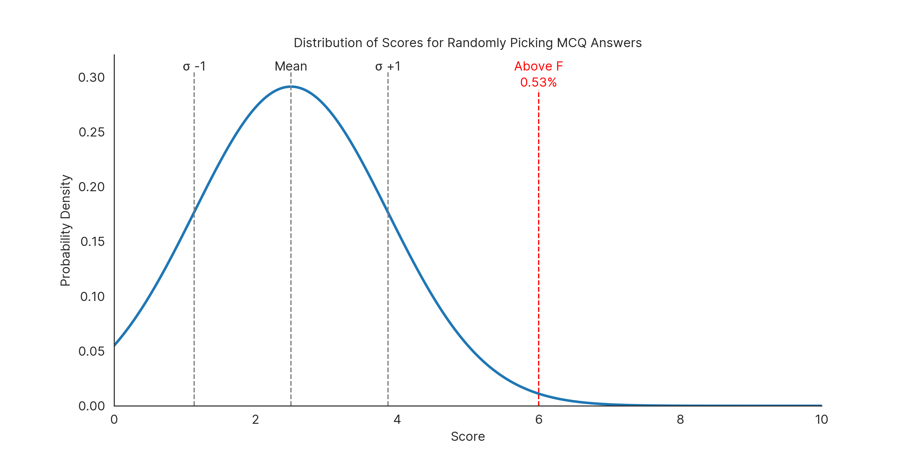

# MCQ-GuessMaster3000

**_When you've binge-watched one too many episodes instead of studying for your quiz!_**

Welcome to the ultimate MCQ random guessing simulator. Ever wondered what your odds were if you just guessed everything? Well, we've got the answers!

## Features



- Predicts your possible score when you go "eeny, meeny, miny, moe..." on your MCQs.
- Shows off fancy graphs that'll make you feel you're into something legit.
- Gives you the false hope needed to hit that 'Submit' button with confidence!

## How to Use
1. Clone the repo.
2. Install the requirements using `pip install -r requirements.txt`. 
3. Just follow the prompts and pray for the best!

## Disclaimer
Results from the MCQ-GuessMaster3000 may vary in real life. Also, please consider actually studying next time. 🤓

## File structure:
```txt
/MCQ-GuessMaster3000
├── Inter-Regular.ttf -> Font file for the graphs.
├── main.py -> The main script that runs the program.
├── plot.png -> The example plot.
├── README.md -> You are here! 😎
└── requirements.txt -> Contains the required packages to run the program.
```
